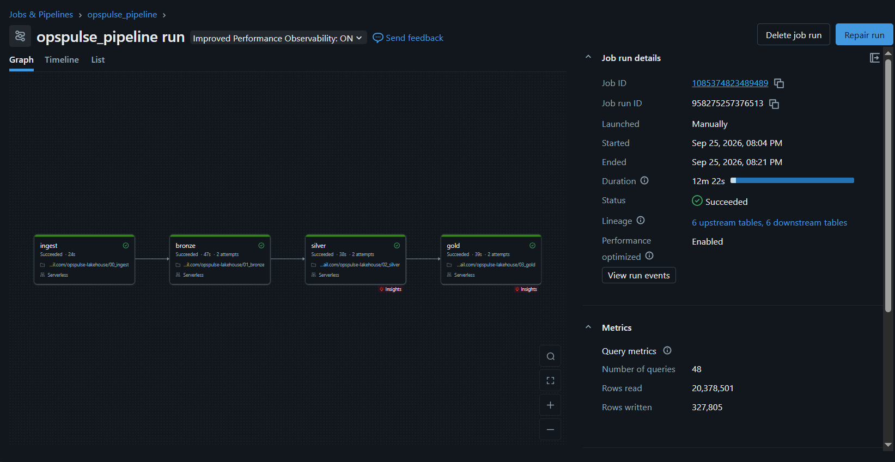

# OpsPulse Lakehouse

First Databricks project, built on **Databricks Free Edition** (serverless-only) — Week 12–13
(Spark + Databricks) of a self-paced data engineering roadmap, #deroadmap26.

Pipeline for GitHub public activity (GH Archive) built on the Medallion architecture with Unity
Catalog, orchestrated end-to-end as a Databricks Job.

## Pipeline Run



Job `opspulse_pipeline` (4 tasks: `ingest → bronze → silver → gold`, each depending on the
previous one) runs end-to-end on serverless compute. All four tasks complete successfully on a
fresh run, and re-running the job with no new source data is a no-op at every layer (verified via
row counts and `nothing to do` log lines — see "Data quality checks" below).

| Task | Purpose | Typical duration |
|---|---|---|
| `ingest` | Downloads new hourly GH Archive files into the Volume landing zone | ~20–25s |
| `bronze` | Auto Loader ingest of new files into Bronze | ~20–50s |
| `silver` | Incremental parse/flatten/dedup/bot-filter into Silver | ~20–40s |
| `gold` | Incremental dimension join + aggregations into Gold | ~20–40s |

Job configuration (task graph, dependencies) is exported as JSON in `docs/job_config.json`.

## Architecture

```
GH Archive (hourly .json.gz)
        │  requests, outside Databricks
        ▼
Volume: opspulse.bronze.landing/date=YYYY-MM-DD/hour=HH/
        │  Auto Loader, trigger availableNow
        ▼
Bronze: opspulse.bronze.gh_events_raw   (raw_json string + source_file + ingest_ts)
        │  from_json, flatten actor/repo/org/payload, dedup, bot filter
        ▼
Silver: opspulse.silver.gh_events       (partitioned by event_date)
        │  broadcast join with dim_event_type, 4 aggregations
        ▼
Gold:   trending_repos_daily, top_contributors,
        event_type_mix, hourly_activity   (partitioned by event_date[, event_hour])
```

Databricks Job `opspulse_pipeline`: `ingest → bronze → silver → gold`, each task depending on the
previous one, run on serverless compute.

## Notebooks

| Notebook | Purpose |
|---|---|
| `_common` | Shared config (catalog/schema/table names, paths) and a logger factory |
| `00_ingest` | Downloads new hourly GH Archive files into the Volume landing zone (idempotent, capped per run) |
| `01_bronze` | Auto Loader ingest of raw JSON lines into Bronze, with lineage columns |
| `02_silver` | Parses, flattens, dedups, filters bots, writes Silver incrementally via `MERGE` |
| `03_gold` | Dimension table, broadcast join, 4 Gold aggregations, partitioned incremental write |
| `04_performance` | Repartition, cache, and broadcast-join experiments with before/after timings |

## Design trade-offs

**Bronze keeps raw JSON as a string, not parsed columns.**
GH Archive's `payload` shape differs per event type, so a single Bronze schema would be fragile.
Parsing happens once, in Silver, against an explicit schema (`from_json`). Trade-off: Bronze
can't be queried directly by column, only by `source_file` / `ingest_ts` lineage.

**Bot filtering is a login-pattern heuristic, not a ground truth.**
Accounts are flagged as bots if their login ends in `[bot]` or a `-bot`/`_bot` suffix. In our data
this removed **~12–13%** of Bronze rows. Some bots without such names are missed, and rare human
accounts named like a bot would be dropped. Documented, not silently assumed correct.

**Silver is partitioned by `event_date` only, not `event_date + event_hour`.**
Each hour has only ~100–130K rows; partitioning by hour as well would create many small files
with no read benefit at this data volume.

**Incremental logic uses a watermark, not a “new files” flag.**
Silver reads only Bronze rows where `ingest_ts` is newer than Silver's current
`max(bronze_ingest_ts)`. Gold reads only dates whose Silver watermark is newer than Gold's
`hourly_activity.computed_at`. If a batch is *all* bots/invalid rows, the watermark doesn't
advance and that batch is harmlessly reprocessed next run (`MERGE`/`replaceWhere` prevent
duplication) — a documented inefficiency, not a bug.

**`hourly_activity` is written last in Gold, deliberately.**
It's the "commit marker" that `dates_to_process()` reads to decide what's already done. If the
Gold job fails partway through (after writing `trending_repos_daily` but before
`hourly_activity`), the next run still sees that date as pending and reprocesses it — the other
three tables are simply overwritten again for that date via `replaceWhere`.

**Trending score required a minimum distinct-actor threshold.**
An early version scored repos purely by weighted event count. The top 10 were dominated by
single accounts push-spamming one repo (`unique_actors = 1`, `stars = 0` for every entry).
Added `MIN_UNIQUE_ACTORS = 3` so a repo only counts as "trending" with activity from several
different people — a design choice, not a validated definition of "trending".

**Small dimension tables get auto-broadcast by Photon regardless of hints.**
`dim_event_type` has 12 rows. `explain()` showed `PhotonBroadcastHashJoin` in *both* the
explicitly-broadcast join and the "normal" join — Spark's optimizer broadcasts small tables on
its own. The `F.broadcast()` hint made no measurable difference (1.06x, within noise) at this
table size; it would matter more against a larger dimension table.

## Free Edition limitations hit in practice

| Limitation | What happened | Workaround |
|---|---|---|
| No RDD APIs on serverless | `silver.rdd.getNumPartitions()` failed with `RDD_NOT_SUPPORTED` | Used `F.spark_partition_id()` (a DataFrame function) instead |
| `.cache()` unsupported on serverless | `[NOT_SUPPORTED_WITH_SERVERLESS] PERSIST TABLE is not supported` | Wrapped in try/except; documented as a platform constraint, not a code bug |
| No Spark UI on serverless | Can't inspect jobs/stages visually | Used `.explain()` and wall-clock timing (`time.time()`) instead |
| Serverless session can detach after inactivity | Notebook state (`%run` variables/functions) is lost mid-work, causing `NameError` | Re-run `%run ./_common` and function-definition cells before re-running action cells; "Run all" avoids this |
| Job compute is a separate serverless allocation from the interactive notebook | First Job run took ~10 min on the `bronze` task (cold start / resource contention) vs ~1s interactively | `Repair run` retried only the failed downstream tasks; second attempt completed in seconds |

## Performance experiments (`04_performance`)

Data volume at time of testing: ~1.3M Silver rows (12 hours of GH Archive, 2026-09-20).

| Experiment | Before | After | Result |
|---|---|---|---|
| `repartition(8)` vs default (3 partitions) | 0.66s | 0.66s | No speedup (0.99x) — shuffle cost cancels the benefit at this data size; expected to matter more after a multi-day backfill |
| `.cache()` vs no cache (4 downstream aggregations) | 2.64s | N/A | `.cache()` raised `NOT_SUPPORTED_WITH_SERVERLESS`; not usable on Free Edition serverless |
| Broadcast join vs normal join | 0.88s | 0.83s | 1.06x — within noise; Photon auto-broadcasts the 12-row dimension table either way |

Since `.gz` files are not splittable, each hourly file is read as a single task — parallelism in
Bronze is bounded by file count, a factor that will matter more once the plan's 3–7 day backfill
runs across many more hourly files.

## Data quality checks

- Null checks on all key Silver columns (`event_id`, `event_type`, `created_at`, `repo_id`,
  `actor_login`, `event_date`, `event_hour`) — 0 nulls observed.
- Duplicate `event_id` check on every Silver run — 0 duplicates.
- Invalid-row count tracked and logged on every Silver run (rows failing the `VALID_CONDITION`).
- Bot-row count tracked and logged, verified absent from the written Silver table.
- Idempotency verified manually at every stage: re-running Bronze/Silver/Gold with no new source
  data produces `0 new rows` / `nothing to do` and unchanged row counts.
- Same idempotency verified end-to-end through the Databricks Job itself.

## Status

Bronze → Silver → Gold → Job orchestration is complete and idempotency-tested. `push_size` /
`push_distinct_size` fields were found to be unpopulated (~0% fill rate) in current GH Archive
`PushEvent` payloads and are excluded from Gold metrics as a result.